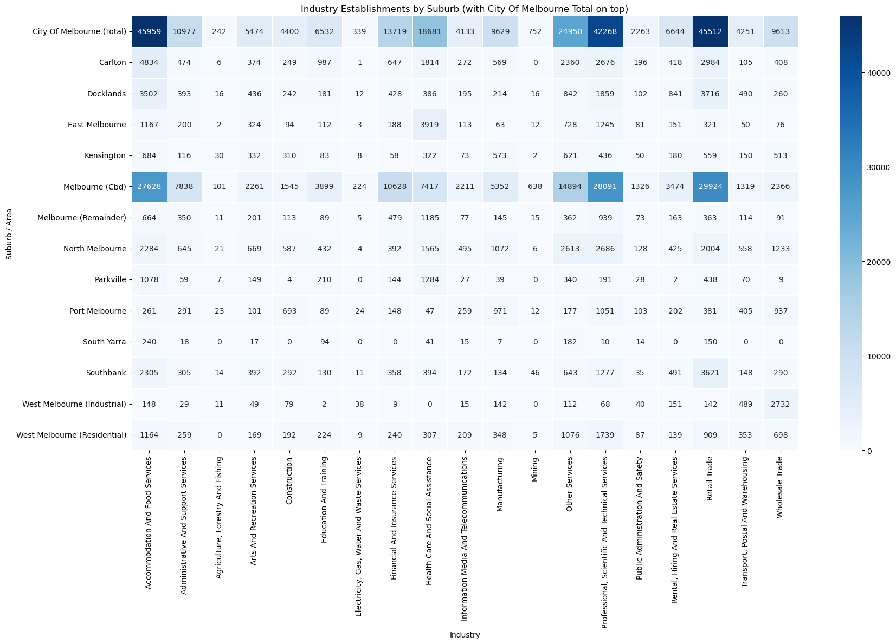
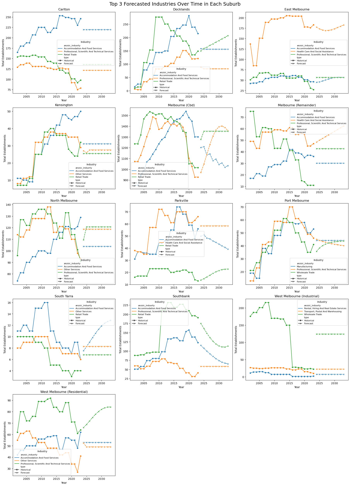
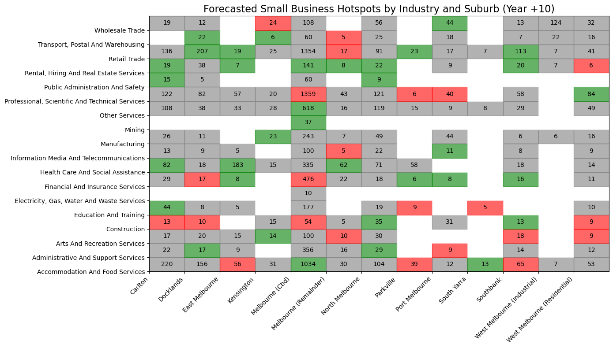
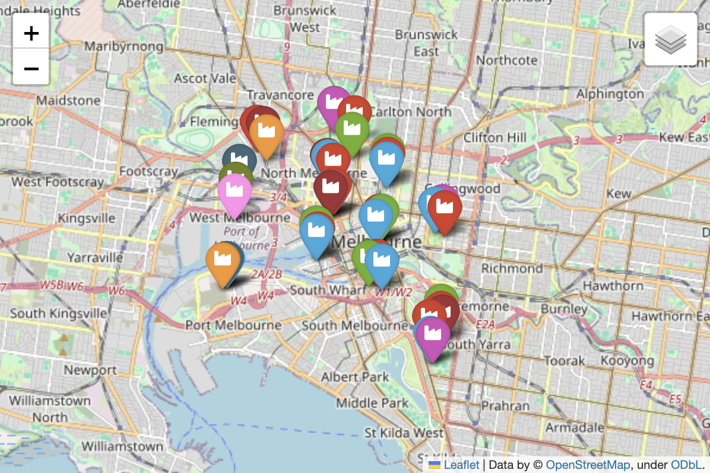

# Melbourne Small Business Hotspot Analysis

A data analytics and forecasting project using City of Melbourne open data to identify small business hotspots and growth trends.

## Project Overview

This project analyses small business establishment trends across Melbourne suburbs to identify commercial hotspots by industry and forecast future growth patterns.

Using open data from the City of Melbourne, this analysis supports evidence-based economic planning by identifying where targeted investment and business support initiatives can drive sustainable local growth.

---

## Business Problem

Economic development officers need to understand:

* Which industries are concentrated in specific suburbs
* How business activity has changed over time
* Which areas show strongest future growth potential
* Where support programs and investment should be prioritised

This project provides suburb-level forecasting insights to support strategic decision-making.

---

## Data Sources

All datasets are retrieved dynamically via the City of Melbourne Open Data API.  
No static datasets are stored in this repository.

### Business Establishments and Jobs Data

Historical business establishment counts by:

* Industry
* Business size
* Suburb
* Census year

### Business Establishments Location and Industry Classification

Business-level geographic information including:

* Latitude and longitude
* ANZSIC industry classification
* Suburb distribution

**Source:** City of Melbourne Open Data Platform

---

## Technical Stack

**Programming:** Python, Pandas, NumPy

**Visualisation:** Matplotlib, Seaborn, Folium

**Forecasting Models:**

* CAGR
* Linear Regression
* Exponential Smoothing
* ARIMA

**Data Access:** API Integration

---

## Methodology

### 1. Data Collection

Retrieved datasets through City of Melbourne public API endpoints.

### 2. Data Cleaning and Preparation

* Removed missing values
* Standardised industry classifications
* Filtered for small businesses
* Removed duplicates
* Applied ANZSIC industry mapping

### 3. Exploratory Analysis

Performed suburb-wise and industry-wise hotspot analysis using:

* Heatmaps
* Comparative bar charts
* Trend analysis
* Geospatial mapping

### 4. Forecasting

Evaluated multiple forecasting approaches using Mean Absolute Error and selected the best-performing model for each suburb-industry combination.

### 5. Growth Classification

Classified forecasted business activity as:

* Emerging
* Stable
* Declining

---
## Key Outcome

This project delivers a data-driven understanding of Melbourne’s small business ecosystem by identifying current industry hotspots and forecasting future growth patterns across suburbs.

The insights support urban planning, SME development, and targeted economic investment strategies.

---
## Key Insights

### Melbourne CBD

Strong projected growth across:

* Accommodation and Food Services
* Retail Trade
* Professional Services

### Docklands

Emerging commercial growth driven by:

* Retail Trade
* Health Care
* Professional Services

### Carlton

Continued dominance in hospitality and food services.

### East Melbourne and Parkville

Strong healthcare and social assistance growth corridors.

### West Melbourne (Residential)

Increasing growth in professional and consulting services.

---

## Business Recommendations

### Targeted Business Support

Prioritise startup incentives for:

* Hospitality businesses in Carlton and Southbank
* Healthcare services in East Melbourne and Parkville
* Professional services in Docklands and West Melbourne

### Urban Planning

Support infrastructure investment in emerging mixed-use commercial suburbs.

### Economic Development Strategy

Monitor industrial-to-commercial transition zones for redevelopment opportunities.

---

## Key Visualisations

### Industry Hotspot Heatmap

### Top Industries by Suburb (Percentage)

### Forecast Trend Analysis

### Future Business Hotspots

### Business Distribution Map

---

## Repository Structure

notebooks/
visualisations/
README.md

---

