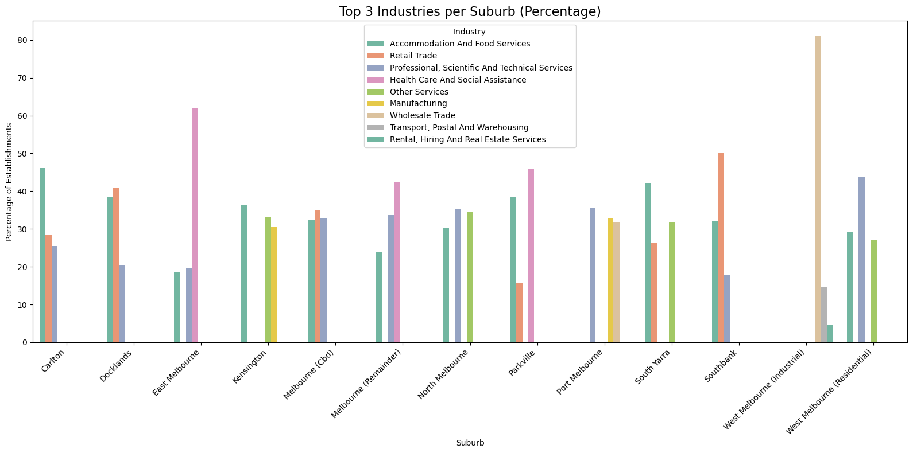

# Melbourne Small Business Hotspot Analysis

A data analytics and forecasting project using City of Melbourne open data to identify small business hotspots and growth trends across Melbourne suburbs.

---

## Project Overview

This project analyses small business establishment trends across Melbourne suburbs to identify industry hotspots and forecast future growth patterns.

Using open data from the City of Melbourne, this analysis supports evidence-based economic planning by identifying where targeted investment and business support initiatives can drive sustainable local growth.

---

## Business Problem

Economic development teams need insights into:

- Which industries are concentrated in specific suburbs  
- How business activity has changed over time  
- Which areas show the strongest future growth potential  
- Where investment and support programs should be prioritised  

This project provides suburb-level forecasting insights to support strategic decision-making.

---

## Data Sources

All datasets are retrieved dynamically via the City of Melbourne Open Data API.  
No static datasets are stored in this repository.

### Business Establishments and Jobs Data
Historical business establishment counts by:

- Industry  
- Business size  
- Suburb  
- Census year  

### Business Establishment Location & Classification Data
Business-level geographic information including:

- Latitude and longitude  
- ANZSIC industry classification  
- Suburb distribution  

**Source:** City of Melbourne Open Data Platform

---

## Technical Stack

- **Programming:** Python, Pandas, NumPy  
- **Visualisation:** Matplotlib, Seaborn, Folium  
- **Forecasting Models:** CAGR, Linear Regression, Exponential Smoothing, ARIMA  
- **Data Access:** City of Melbourne Open Data API  

---

## Methodology

### 1. Data Collection
Data retrieved using City of Melbourne public API endpoints.

### 2. Data Cleaning & Preparation
- Removed missing values  
- Standardised industry classifications  
- Filtered for small businesses  
- Removed duplicates  
- Applied ANZSIC mapping  

### 3. Exploratory Data Analysis
Performed suburb-wise and industry-wise hotspot analysis using:
- Heatmaps  
- Bar charts  
- Trend analysis  
- Geospatial maps (Folium)  

### 4. Forecasting
Evaluated multiple models and selected the best-performing approach using error metrics (MAE).

Models used:
- CAGR  
- Linear Regression  
- Exponential Smoothing  
- ARIMA  

### 5. Growth Classification
Industries classified as:
- Emerging  
- Stable  
- Declining  

---

## Key Outcome

This project provides a data-driven view of Melbourne’s small business ecosystem by identifying current industry hotspots and forecasting future growth patterns across suburbs.

The insights support:
- Urban planning  
- SME development  
- Economic investment strategies  

---

## Key Insights

### Melbourne CBD
Strong projected growth in:
- Accommodation & Food Services  
- Retail Trade  
- Professional Services  

---

### Docklands
Emerging commercial growth driven by:
- Retail Trade  
- Health Care  
- Professional Services  

---

### Carlton
Continued dominance in hospitality and food services.

---

### East Melbourne & Parkville
Strong healthcare and social assistance growth corridors.

---

### West Melbourne
Increasing growth in professional and consulting services.

---

## Key Visualisations

### Industry Hotspot Heatmap

### Top Industries by Suburb

### Forecast Trend Analysis

### Future Business Hotspots

### Business Distribution Map

---

## Repository Structure
notebooks/
visualisations/
README.md

---

## Key Takeaway

Melbourne’s small business growth is increasingly concentrated in service-based industries, with clear emerging hotspots in CBD, Docklands, and healthcare-related suburbs.

---

## 👤 Author

**Yuvarani Dharmasivam**  
Master of Data Science – Deakin University
